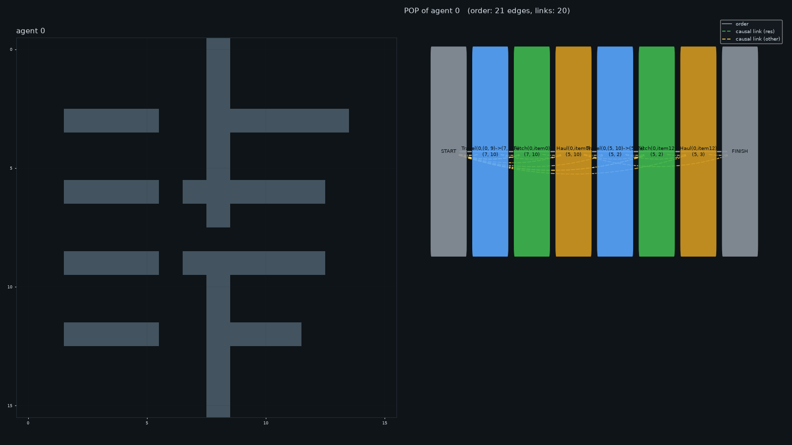
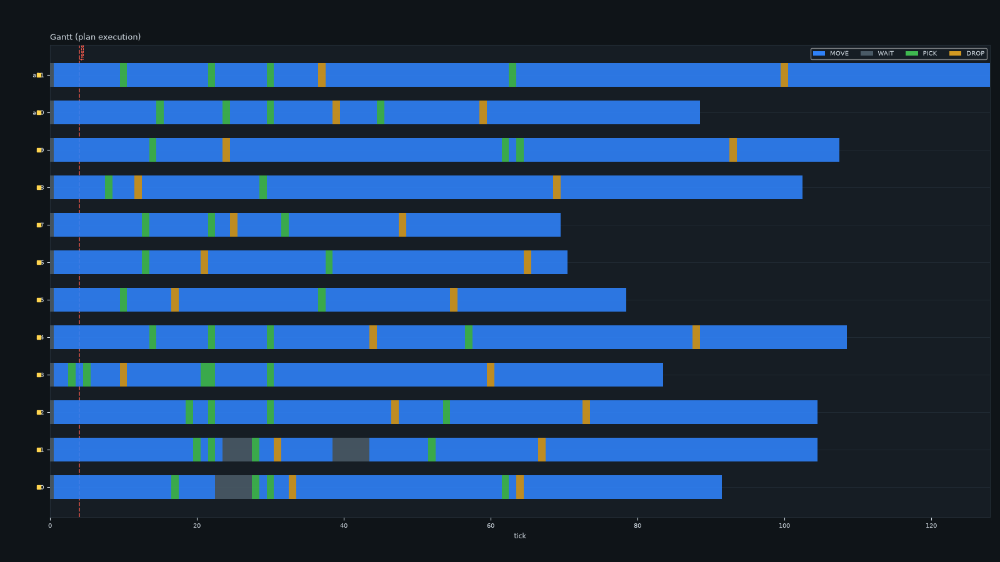
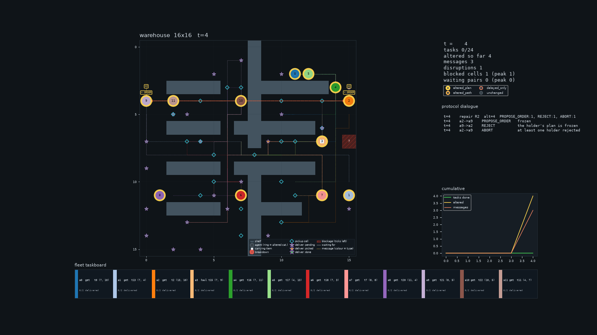
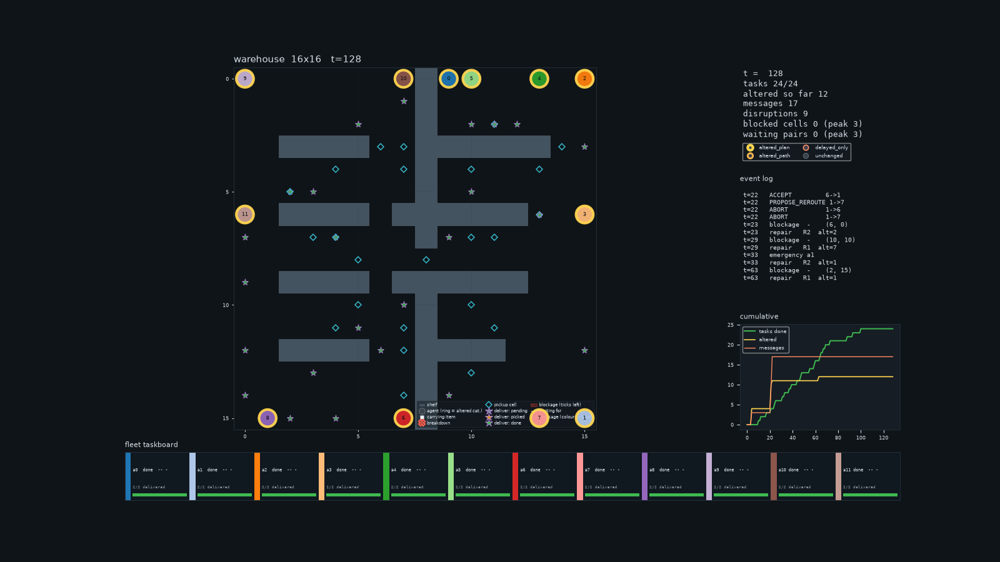
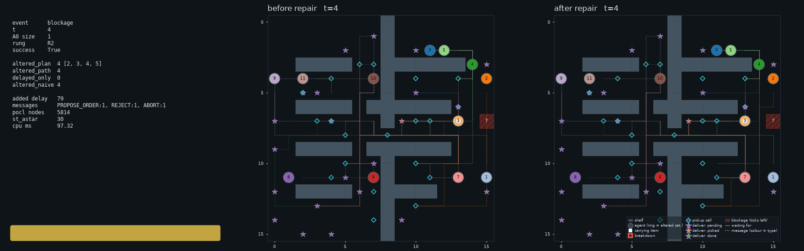
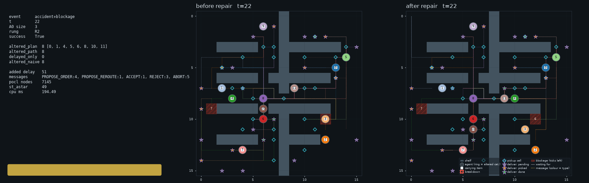
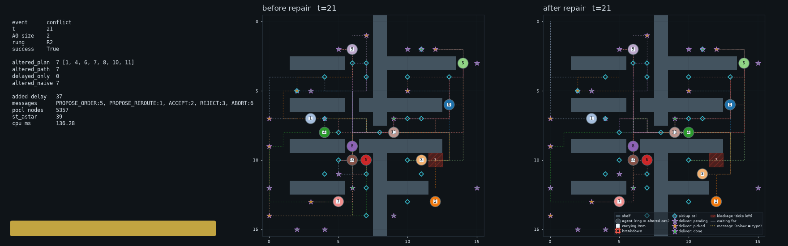
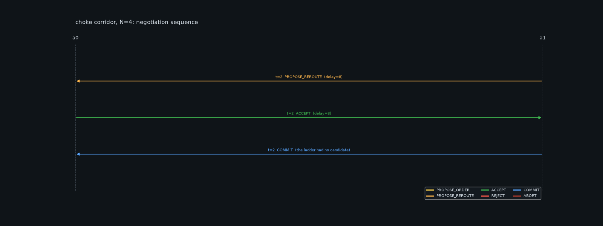
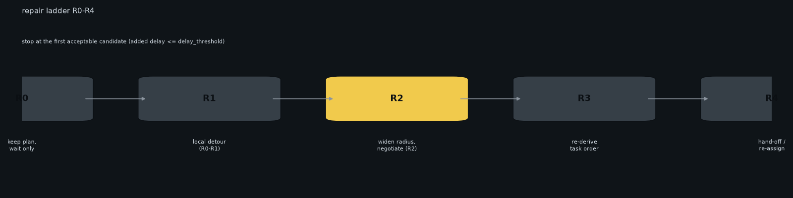
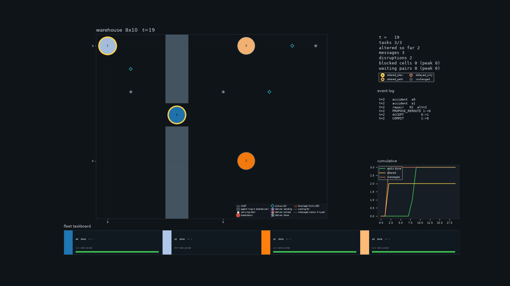

# Warehouse disruption repair: POCL + plan modification

Generated 2026-10-04 17:53 from commit 42acd73 (python 3.12.14, PYTHONHASHSEED=<unset>).

Sources, the test suite and every generated artefact (animated GIFs of both case studies, the repair cards and this report) live at:

[https://github.com/aaditya-biswas/AS_Assignment](https://github.com/aaditya-biswas/AS_Assignment)

## 1. Problem statement and assumptions

A fleet of robots serves pickup/delivery tasks on a shelf grid. Disruptions -- exogenous blockages and endogenous accidents/emergencies -- invalidate the plan; the repair must be local, fast and safety-preserving.

Assumptions: unit cells and 4-neighbour moves, one robot per cell per tick, time-indexed vertex and edge reservations, negotiation only within comm_radius, a bounded repair budget, and no global re-planning inside a repair.

## 2. Three-layer architecture

| Layer | Module | Responsibility (POCL mapping) |
|---|---|---|
| L1 partial order | pocl.py | STRIPS operators, threats, POP search |
| L2 grounding | planner.py / peg.py | space-time A*, PEG retiming |
| L3 repair | modify.py / negotiation.py | the R0-R4 ladder + protocol |

## 3. Case study A: congested warehouse (aisle closed)

One cross-aisle is closed for maintenance, so the fleet funnels through a single door, and the shift starts with closed lanes, robots down and one emergency diversion. That is the shift `run_demo.py` animates, so the panels show live counters (altered agents, protocol messages, disruptions, blocked cells, waiting pairs) rather than the five zeros of an all-clear run.

| case | tasks | makespan | safe | repairs | altered (sum) | messages | rungs | FAILED_INIT |
|---|---|---|---|---|---|---|---|---|
| negotiate, 16x16 grid (aisle closed), N=12 | 24/24 | 128 | yes | 8 | 32 | 17 | {"R1": 2, "R2": 6} | 0 |

| metrics-panel counter | peak in this run |
|---|---|
| altered agents | 12 |
| protocol messages | 17 |
| disruptions | 9 |
| blocked cells (peak) | 3 |
| waiting pairs (peak) | 3 |

None of the five metrics-panel counters is zero in this run: 12 altered agents, 17 protocol messages, 9 disruptions, up to 3 closed cells at once and up to 3 queueing pairs at once. The animated GIF of the same shift is `outputs/negotiate/animation.gif`.



*A POP of an altered agent (L1).*



*Per-agent Gantt of the repaired schedule.*



*Metrics panel with the protocol dialogue.*



*Final state of the fleet.*

## 3.1 Repair cards

4 repair card(s): the RepairRecord (rung, altered sets, message counts, budgets) beside the routes before and after.



*repair card 00 t4*


*repair card 01 t21*



*repair card 02 t22*



*repair card 03 t21*

## 4. Altered agents per disruption (SPEC 9.5)

| definition | mean | median | max |
|---|---|---|---|
| altered_plan | 4 | 3 | 8 |
| altered_path | 4.125 | 3 | 8 |
| delayed_only | 0 | 0 | 0 |
| altered_naive | 4.125 | 3 | 8 |

| t | event | rung | altered_plan | altered_path | delayed_only | altered_naive | added_delay | messages (cumulative) | cpu_ms | success |
|---|---|---|---|---|---|---|---|---|---|---|
| 4 | blockage | R2 | 4 | 4 | 0 | 4 | 79 | 3 | 97.3 | yes |
| 21 | blockage | R2 | 2 | 2 | 0 | 2 | 13 | 6 | 118 | yes |
| 22 | accident+blockage | R2 | 8 | 8 | 0 | 8 | 51 | 14 | 194.5 | yes |
| 21 | conflict | R2 | 7 | 7 | 0 | 7 | 37 | 17 | 136.3 | yes |
| 23 | blockage | R2 | 2 | 2 | 0 | 2 | 10 | 17 | 44.3 | yes |
| 29 | blockage | R1 | 7 | 8 | 0 | 8 | 1 | 17 | 86.5 | yes |
| 33 | emergency | R2 | 1 | 1 | 0 | 1 | 24 | 17 | 41.9 | yes |
| 63 | blockage | R1 | 1 | 1 | 0 | 1 | 2 | 17 | 8.5 | yes |

## 5. Case study B: the corridor choke point

A single-door corridor forces a clash, so the ladder finds no hard candidate and the initiator negotiates a grant (rung R2): PROPOSE_REROUTE -> ACCEPT -> COMMIT. Case A now speaks too -- the closed aisle funnels the fleet through one door, so holders clash and the protocol answers -- but the corridor remains the minimal instance where a repair *cannot* be a silent local detour.

| case | tasks | makespan | safe | repairs | altered (sum) | messages | rungs | FAILED_INIT |
|---|---|---|---|---|---|---|---|---|
| choke corridor, N=4 | 3/3 | 19 | yes | 1 | 2 | 3 | {"R2": 1} | 0 |

| metrics-panel counter | peak in this run |
|---|---|
| altered agents | 2 |
| protocol messages | 3 |
| disruptions | 2 |
| blocked cells (peak) | 0 |
| waiting pairs (peak) | 0 |



*The message sequence diagram of the pass.*



*The R0-R4 ladder, with the used rungs lit.*



*The corridor at the final tick.*

## 6. Experiments

No sweep data found; run `python experiments.py --sweep A --seeds 10 --plots` to fill this section.

## 7. Discussion

Partial orders plus negotiation keep the altered set small: negotiate alters far fewer agents than the global baseline at a comparable makespan, and the corridor shows the protocol only speaks when a holder really parks in the way. Remaining risks: prioritized-planning incompleteness, deadlock under a fully blocked choke, and the failure_wait fallback (rung R4) when no candidate exists.

## 8. How to run

Everything is reproducible from the published repository:

```
git clone https://github.com/aaditya-biswas/AS_Assignment
cd AS_Assignment && pip install -r requirements.txt
python run_demo.py --compare --viz --outdir outputs
python run_demo.py --choke --compare --viz --outdir outputs/choke
python experiments.py --sweep grid --seeds 10 --plots
python make_report.py --data outputs --zip
```

The animated GIFs of the shifted warehouse are `outputs/negotiate/animation.gif` and `outputs/bfs/animation.gif`; the corridor showcase is `outputs/choke/negotiate/animation.gif`. Pass `--open-warehouse` to run the same shift on the open floor instead of the closed aisle.

## 9. References

```
UCPOP (1992); Weld (1994); Kambhampati & Hendler (1992); Fox et al. (2006); Silver (2005); Hoenig et al. (MAPF-POST, 2016).
```

